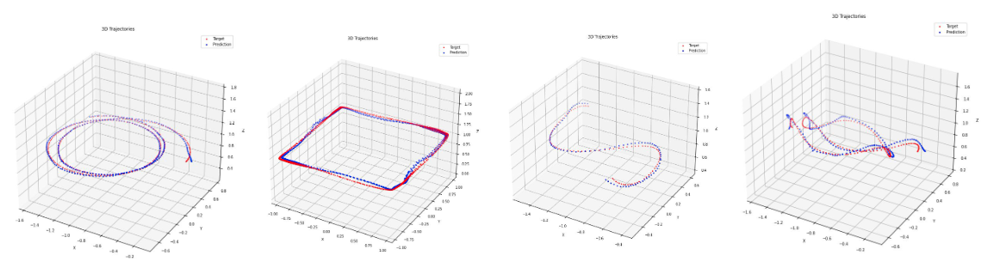

# Drone Pose Prediction in Laboratory Environment

This project is based on the paper "Flight trajectory prediction enabled by time-frequency wavelet transform" by Zhang et al. The repository has been adapted as a final project for the Skoltech course "Theoretical Methods of Deep Learning." It focuses on predicting drone poses in a laboratory environment. All necessary scripts for data analysis and plotting are included.

<p  align="middle"></p>

## Paper Details
- **Reference**: Zhang, Z., Guo, D., Zhou, S. et al. *Flight trajectory prediction enabled by time-frequency wavelet transform*. Nat Commun 14, 5258 (2023). [DOI:10.1038/s41467-023-40903-9](https://doi.org/10.1038/s41467-023-40903-9)
- **Original Repository**: [https://github.com/MusDev7/wtftp-model](https://github.com/MusDev7/wtftp-model)

## Contributors
- **Valerii Serpiva**  
  System Engineering PhD, Skoltech  
  Email: valerii.serpiva@skoltech.ru
<<<<<<< HEAD
- **Sausar Karaf** 
  System Engineering PhD, Skoltech  
=======
- **Sausar Karaf**
  System Engineering PhD, Skoltech 
>>>>>>> abb9a7bbc7b19f60714a2f71a1124b2cc069e5f3
  Email: Sausar.Karaf@skoltech.ru

## How to Use

### Training
To start training the model, use the following command:
```bash
python train.py --saving_model_num 1 --minibatch_len 10 --lr 0.0002 --interval 1 --epoch 40 --batch_size 64 --maxlevel 1
```

### Inference
To infer the model on a test dataset, run:
```bash
python infer.py --netdir /home/vs/wtftp-model/log/24-12-19_att_len_1/epoch_40.pt \
                --datadir /home/vs/wtftp-model/data_set_for_test/test_3 \
                --minibatch_len 10 --interval 1 --pre_len 1 --batch_size 1024
```

### Testing Different Models
You can test different models using the following commands:
```bash
python infer.py --netdir /home/vs/wtftp-model/log/24-12-19_att_1_len_1/epoch_40.pt \
                --datadir /home/vs/wtftp-model/data_set_for_test/test_3 \
                --minibatch_len 10 --interval 1 --pre_len 1 --batch_size 1024

python infer.py --netdir /home/vs/wtftp-model/log/24-12-19_att_2_len_1/epoch_40.pt \
                --datadir /home/vs/wtftp-model/data_set_for_test/test_3 \
                --minibatch_len 10 --interval 1 --pre_len 1 --batch_size 1024

python infer.py --netdir /home/vs/wtftp-model/log/24-12-19_att_3_len_1/epoch_40.pt \
                --datadir /home/vs/wtftp-model/data_set_for_test/test_3 \
                --minibatch_len 10 --interval 1 --pre_len 1 --batch_size 1024

python infer.py --netdir /home/vs/wtftp-model/log/24-12-19_no_att_1_len_1/epoch_40.pt \
                --datadir /home/vs/wtftp-model/data_set_for_test/test_3 \
                --minibatch_len 10 --interval 1 --pre_len 1 --batch_size 1024

python infer.py --netdir /home/vs/wtftp-model/log/24-12-19_no_att_2_len_1/epoch_40.pt \
                --datadir /home/vs/wtftp-model/data_set_for_test/test_3 \
                --minibatch_len 10 --interval 1 --pre_len 1 --batch_size 1024

python infer.py --netdir /home/vs/wtftp-model/log/24-12-19_no_att_3_len_1/epoch_40.pt \
                --datadir /home/vs/wtftp-model/data_set_for_test/test_3 \
                --minibatch_len 10 --interval 1 --pre_len 1 --batch_size 1024
```

### Evaluation
To evaluate the model on a specific test dataset, use:
```bash
python infer.py --netdir /home/vs/wtftp-model/log/24-12-19_att_3_len_1/epoch_40.pt \
                --datadir /home/vs/wtftp-model/data_set_for_test/test_1 \
                --minibatch_len 10 --interval 1 --pre_len 1
```

## Test Datasets
The folder containing test datasets is located at:
```
/data_set_for_test
